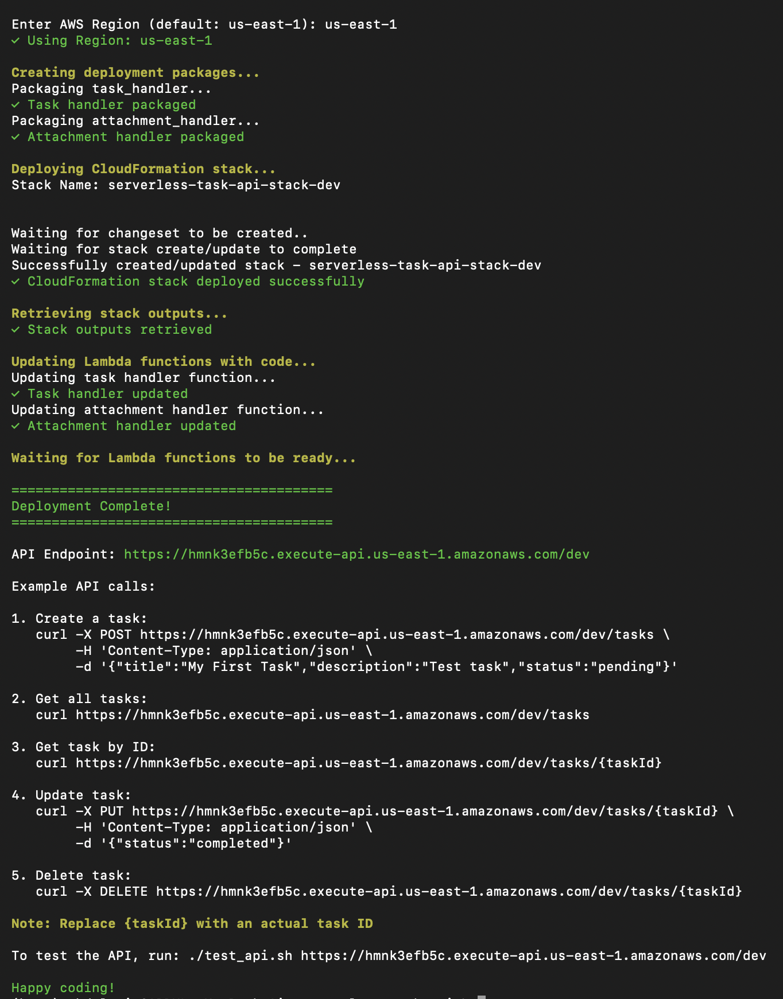
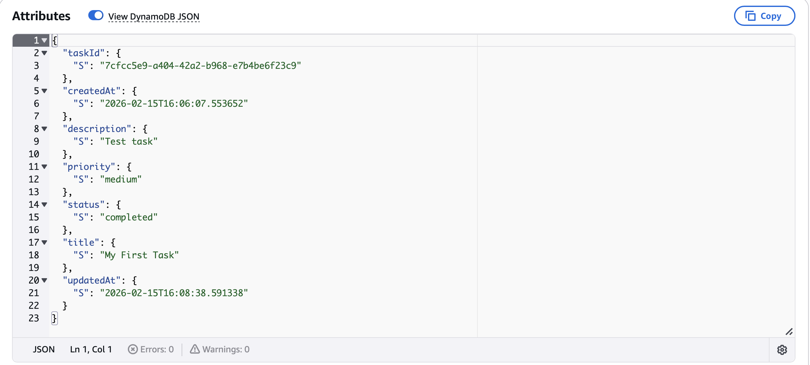
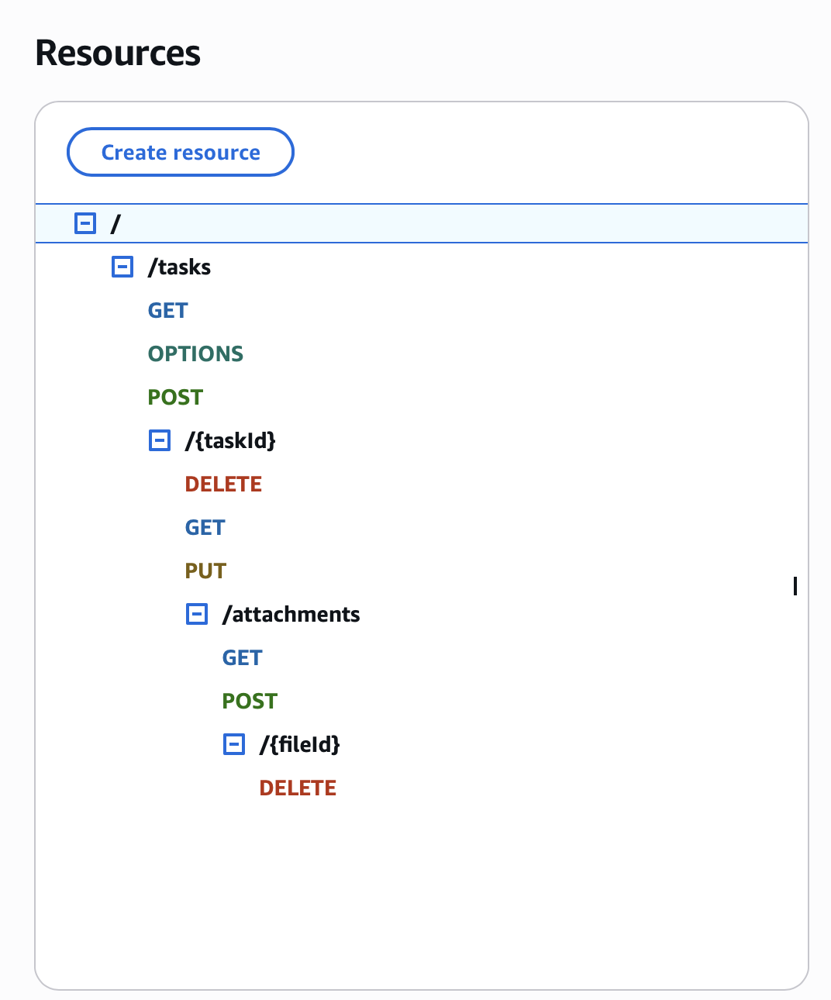
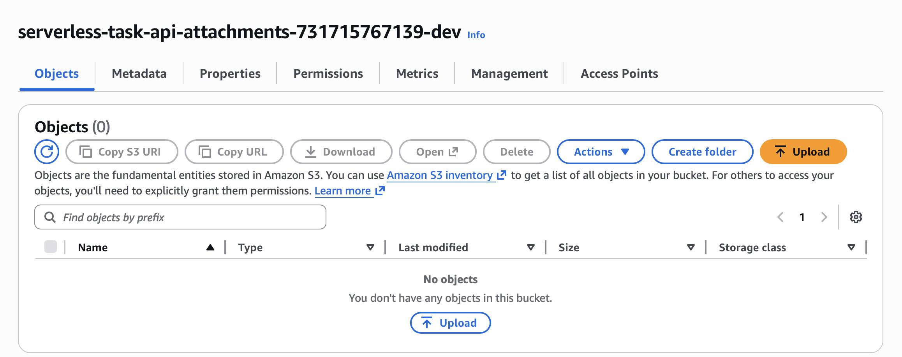

# Serverless Task Management API

A production-ready, cloud-native Task Management API built with AWS serverless services. This project demonstrates modern cloud architecture principles including Infrastructure as Code, event-driven design, and scalable serverless computing.

## 🏗️ Architecture

This project implements a fully serverless REST API using the following AWS services:

- **API Gateway**: RESTful API endpoints with CORS support
- **Lambda**: Python-based serverless compute functions
- **DynamoDB**: NoSQL database for task storage with on-demand billing
- **S3**: Secure file storage for task attachments
- **CloudWatch**: Logging and monitoring with alarms
- **IAM**: Fine-grained access control and security policies
- **CloudFormation**: Infrastructure as Code for repeatable deployments


### Architecture Diagram


### Architectural workflow

```
┌─────────────┐
│   Client    │
└──────┬──────┘
       │
       ▼
┌─────────────────┐
│  API Gateway    │
│   (REST API)    │
└────────┬────────┘
         │
    ┌────┴────┐
    │         │
    ▼         ▼
┌────────┐  ┌────────────┐
│ Lambda │  │   Lambda   │
│ (Task) │  │(Attachment)│
└───┬────┘  └─────┬──────┘
    │             │
    ▼             ▼
┌──────────┐  ┌────────┐
│ DynamoDB │  │   S3   │
│  Table   │  │ Bucket │
└──────────┘  └────────┘
```

## ✨ Features

- **CRUD Operations**: Create, Read, Update, and Delete tasks
- **File Attachments**: Upload and download files associated with tasks
- **Task Filtering**: Filter tasks by status (pending, in-progress, completed)
- **Priority Levels**: Organize tasks by priority (low, medium, high)
- **Due Dates**: Set and track task deadlines
- **Serverless Architecture**: Auto-scaling with pay-per-use pricing
- **Secure Storage**: Encrypted S3 storage for attachments
- **CORS Enabled**: Ready for frontend integration
- **CloudWatch Integration**: Comprehensive logging and monitoring
- **Infrastructure as Code**: Fully automated deployment

## 🚀 Quick Start

### Prerequisites

- AWS Account
- AWS CLI configured with credentials
- Bash shell (Linux, macOS, or WSL on Windows)
- Basic knowledge of AWS services

### Installation

1. **Clone the repository**
   ```bash
   git clone https://github.com/yourusername/serverless-task-api.git
   cd serverless-task-api
   ```

2. **Make scripts executable**
   ```bash
   chmod +x deploy.sh test_api.sh
   ```

3. **Deploy to AWS**
   ```bash
   ./deploy.sh
   ```
   
   The script will:
   - Validate AWS credentials
   - Create deployment packages
   - Deploy CloudFormation stack
   - Update Lambda functions
   - Display API endpoint

4. **Test the API**
   ```bash
   ./test_api.sh
   ```

## 📚 API Documentation

### Base URL
```
https://{api-id}.execute-api.{region}.amazonaws.com/dev
```

### Endpoints

#### 1. Create Task
```bash
POST /tasks
Content-Type: application/json

{
  "title": "Complete AWS Project",
  "description": "Build serverless API",
  "status": "pending",
  "priority": "high",
  "dueDate": "2025-03-01"
}
```

**Response:**
```json
{
  "taskId": "uuid",
  "title": "Complete AWS Project",
  "description": "Build serverless API",
  "status": "pending",
  "priority": "high",
  "dueDate": "2025-03-01",
  "createdAt": "2025-02-15T10:30:00.000Z",
  "updatedAt": "2025-02-15T10:30:00.000Z"
}
```

#### 2. Get All Tasks
```bash
GET /tasks
# Optional: Filter by status
GET /tasks?status=completed
```

**Response:**
```json
{
  "tasks": [...],
  "count": 5
}
```

#### 3. Get Task by ID
```bash
GET /tasks/{taskId}
```

#### 4. Update Task
```bash
PUT /tasks/{taskId}
Content-Type: application/json

{
  "status": "completed",
  "description": "Updated description"
}
```

#### 5. Delete Task
```bash
DELETE /tasks/{taskId}
```

#### 6. Upload Attachment
```bash
POST /tasks/{taskId}/attachments
Content-Type: application/json

{
  "fileName": "document.pdf",
  "fileContent": "base64_encoded_content",
  "contentType": "application/pdf"
}
```

#### 7. Get Attachments
```bash
GET /tasks/{taskId}/attachments
```

#### 8. Delete Attachment
```bash
DELETE /tasks/{taskId}/attachments/{fileId}
```

## 🔧 Configuration

### Environment Variables

The Lambda functions use the following environment variables (automatically configured by CloudFormation):

- `DYNAMODB_TABLE`: DynamoDB table name
- `S3_BUCKET`: S3 bucket for attachments

### Customization

Edit `cloudformation-template.yaml` to customize:
- Region and resource names
- DynamoDB billing mode
- Lambda memory and timeout settings
- S3 lifecycle policies
- CloudWatch alarm thresholds

## 💰 Cost Estimation

This project uses AWS Free Tier eligible services:

- **Lambda**: 1M free requests/month
- **API Gateway**: 1M free requests/month
- **DynamoDB**: 25GB storage + 25 RCU/WCU free
- **S3**: 5GB storage + 20K GET requests free
- **CloudWatch**: Basic monitoring included

**Estimated monthly cost** (beyond free tier): $0-5 for light usage

## 🛡️ Security Features

- **IAM Roles**: Least-privilege access for Lambda functions
- **Encryption**: Server-side encryption for S3 objects
- **Private S3**: All public access blocked
- **CORS**: Configurable cross-origin resource sharing
- **CloudWatch Logs**: Audit trail of all operations


## 📸 Live Deployment Screenshots

### Successful Deployment

*Automated CloudFormation deployment completes in under 5 minutes*

### DynamoDB Database

*Task data stored in serverless NoSQL database with automatic scaling*

### API Gateway Configuration

*RESTful API endpoints with complete CRUD operations*

### Lambda Functions

*Serverless compute functions handling business logic*

### S3 Storage Bucket

*Secure encrypted storage for file attachments*


## 📊 Monitoring

Access CloudWatch logs and metrics:

```bash
# View Lambda logs
aws logs tail /aws/lambda/serverless-task-api-task-handler-dev --follow

# View CloudWatch alarms
aws cloudwatch describe-alarms
```

## 🧪 Testing

Run the comprehensive test suite:

```bash
./test_api.sh https://your-api-endpoint
```

Tests include:
- Task creation, retrieval, update, and deletion
- Status filtering
- File attachment operations
- Error handling

## 🗑️ Cleanup

To delete all AWS resources:

```bash
aws cloudformation delete-stack --stack-name serverless-task-api-stack-dev --region us-east-1
```

**Note**: The S3 bucket must be empty before deletion. Delete all objects first:

```bash
aws s3 rm s3://your-bucket-name --recursive
```

## 📁 Project Structure

```
serverless-task-api/
├── task_handler.py              # Main Lambda function for CRUD operations
├── attachment_handler.py        # Lambda function for file attachments
├── cloudformation-template.yaml # Infrastructure as Code
├── deploy.sh                    # Deployment automation script
├── test_api.sh                  # API testing suite
├── README.md                    # This file
└── architecture.png             # Architecture diagram (optional)
```

## 🎓 Learning Outcomes

This project demonstrates proficiency in:

- AWS Lambda and serverless computing
- API Gateway configuration and integration
- DynamoDB NoSQL database operations
- S3 storage and presigned URLs
- CloudFormation/IaC principles
- IAM security and least-privilege access
- RESTful API design
- Python development for AWS
- CI/CD automation with shell scripts
- CloudWatch monitoring and alarms

## 🤝 Contributing

Contributions are welcome! Please feel free to submit a Pull Request.

## 📄 License

This project is licensed under the MIT License - see the LICENSE file for details.

## 📧 Contact

**Your Name**
- LinkedIn: [Abdul Moiz](https://linkedin.com/in/abdul-moiz-69ab64240)
- GitHub: [Abdulmoiz918](https://github.com/Abdulmoiz918)
- Email: amoiz6208@gmail.com@example.com

## 🌟 Acknowledgments

- Built as part of AWS Solutions Architect certification preparation
- Inspired by modern cloud-native architecture patterns
- Follows AWS Well-Architected Framework principles

---

⭐ If you find this project helpful for your AWS learning journey, please give it a star!
